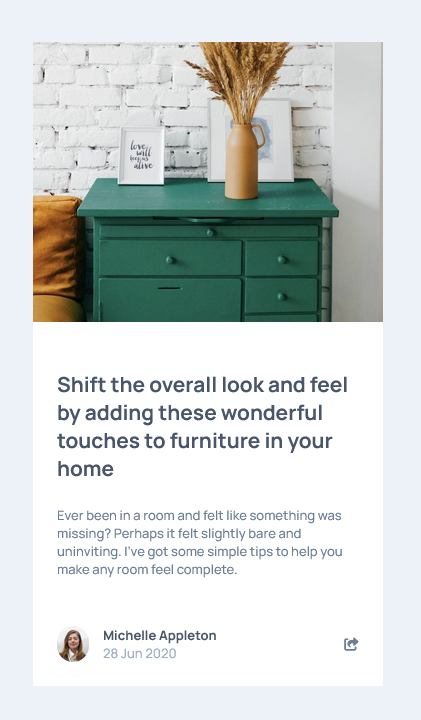
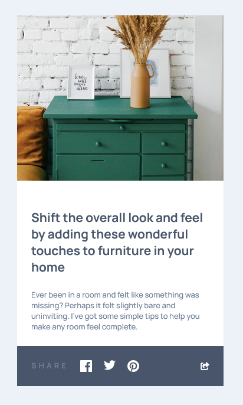
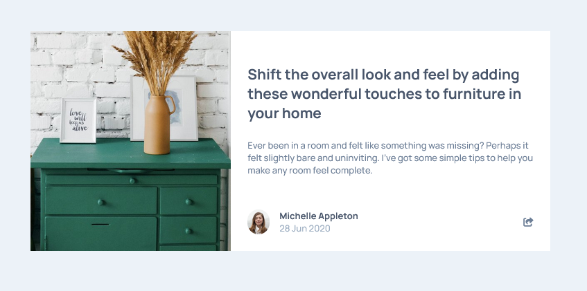
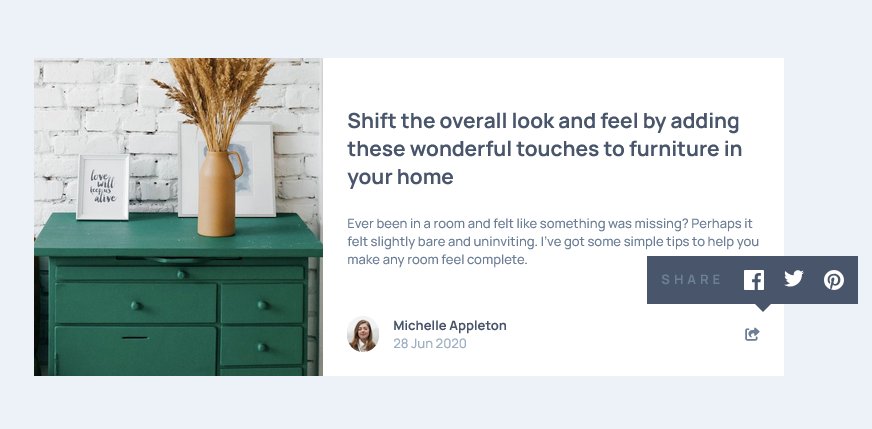

# Frontend Mentor - Article preview component solution

The challenge provided basic knowledge of DOM manipulation including DOM selector, DOM class modify and I provided some state management thought to this challenge!

This is a solution to the [Article preview component challenge on Frontend Mentor](https://www.frontendmentor.io/challenges/article-preview-component-dYBN_pYFT). Frontend Mentor challenges help me improve my coding skills by building a projects.

## Table of contents

- [Overview](#overview)
  - [The challenge](#the-challenge)
  - [Screenshot](#screenshot)
  - [Links](#links)
- [My process](#my-process)
  - [Built with](#built-with)
  - [What I learned](#what-i-learned)
  - [Useful resources](#useful-resources)
- [Author](#author)

---

## Overview

### The challenge

Users should be able to:

- See the social media share links when they click the share icon
- View the optimal layout for each page depending on their device's screen size
- See hover states for all interactive elements on the page

### Screenshot

Below are screenshots illustrating the page preview:

<div align="center">
    
    <br>
    <em>Figure 1: Mobile size.</em>
</div>
<br>
<div align="center">
    
    <br>
    <em>Figure 2: Mobile size actived state.</em>
</div>
<br>
<div align="center">
    
    <br>
    <em>Figure 3: Desktop size.</em>
</div>
<br>
<div align="center">
    
    <br>
    <em>Figure 4: Desktop size actived state.</em>
</div>
<br>

---

## My process

### Built with

- JavaScript - DOM Manipulation
- Semantic HTML5 markup
- CSS custom properties
- Flexbox
- Mobile-first workflow

### What I learned

This section covers basic DOM manipulation using JavaScript. While working on this part, I tried to think in terms of "state managements" which helped me a lot when revisiting and editing the code later.

code example in below:

```js
const updateView = () => {
    updateShareBtnColor()
    if (isShareActive) {
        if (isMobile()) {
            setShareBar()
        }
        else {
            setShareToolTip()
        }
    } else {
        resetView()
    }
}
```

More examples can be found in the project above.

### Useful resources

- [JavaScript DOM Manipulation – Full Course for Beginners](https://www.youtube.com/watch?v=5fb2aPlgoys) - This helped me to learn basic DOM manipulation by doing a mini project for each topics.

---

## Author

- Frontend Mentor - [@pete13232](https://www.frontendmentor.io/profile/pete13232)
